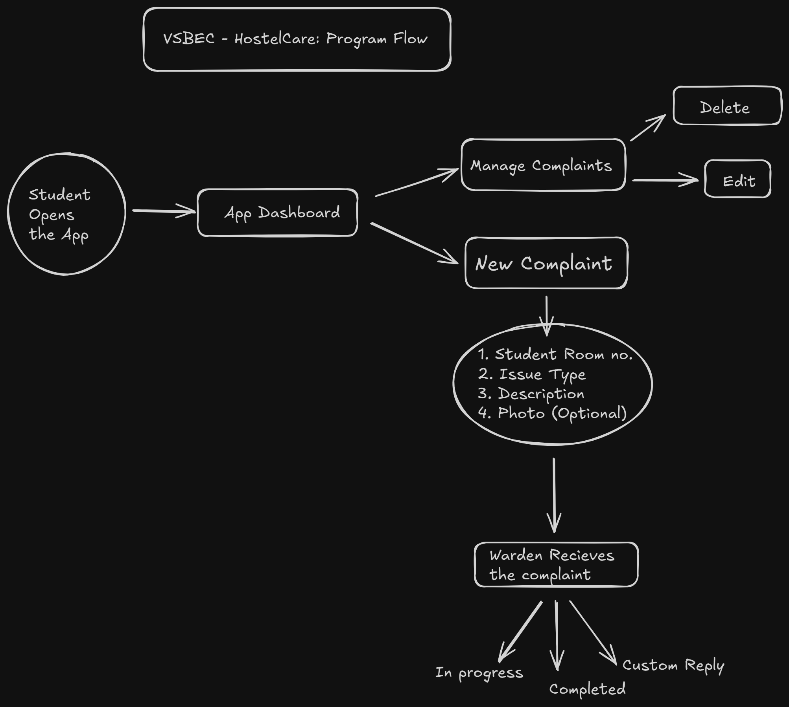

# VSBEC-HostelCare

## Project Features

- Students select their hostel, room no., enter complaint, submit complaint to portal.
- Warden/ Management receives the query and marks as in-progress (or) completed.
- Time deadline is provided for solving the complaint.
- Once the issue is marked as in-progress/ completed - Student recieves notification, and can also raise any complaints if it is not fixed properly.

## Program Flow

